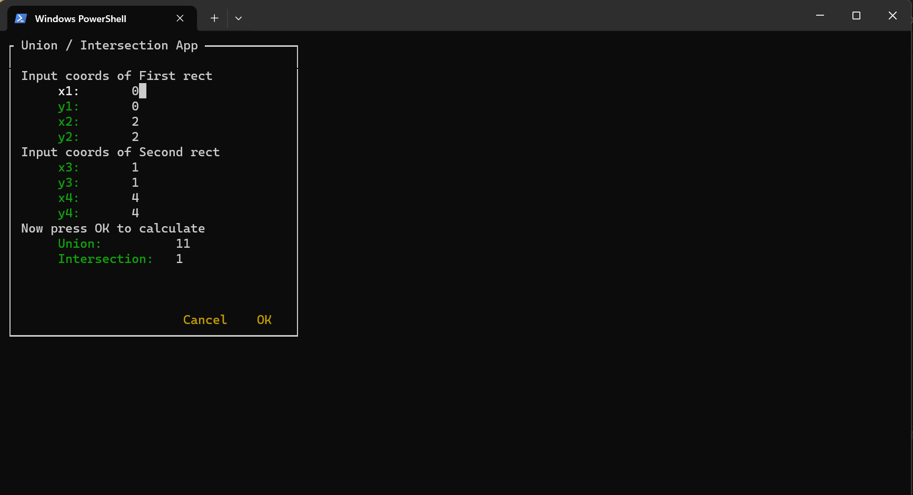

# Lysakovskiy_14_4
This repository is created to solve a problem in the practical work 4 of the subject "Introductory Practical Work".

## Dependencies
Before using repository, make sure you have installed [npyscreen](https://npyscreen.readthedocs.io) module installed.

## Instalation
1. Fork this repository on your pc;
2. ```git pull``` this directory on your computer.

## Launch 
in CMD opened in project directory write comand:
```
python main.py
```

## Usage
After program's launched you will see the window:


Coordinates must be integer!
*x1, y1* - is coordinates of bottom left point of Rectangle;
*x2, y2* - is coordinates of top right point of Rectangle;
This description is working for second Rect.

When you edited all coordinate fields. Press OK button.
You will get 2 new fields at the botom of window, as result of calculation:


## Special Thanks
https://github.com/egorgur - for code documentation